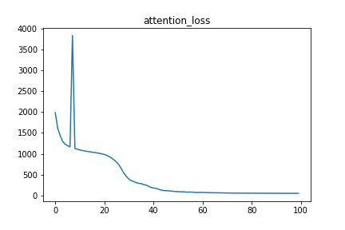
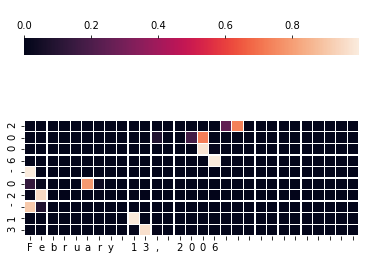
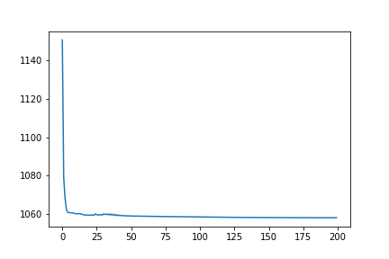
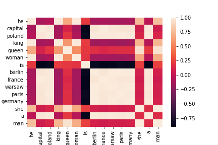
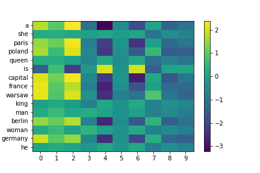

# MXNET_100pon

「ディープラーニング100本(無限)ノック」をMXNetで実装していく  
https://github.com/yoyoyo-yo/DeepLearningMugenKnock

## Attention

### Source_Target_Attention

解く問題   

            ①: september 27, 1994
            ②: _1994-09-27

            ①を②に変換できるようなモデルを作成する

モデル構造  

            Attentionの回数は N = 10
            Attentionへの入力の次元数は d_model = 128
            Feed Forward Networkの１段目のDense Layerの次元数は d_ff = 200
            epoch = 100
            optimizer = sgd
            loss = softmax_crossentropy

loss  

attention_weight  

  

## Word2Vec

実験  
input

            he is a king
            she is a queen
            he is a man
            she is a woman
            warsaw is poland capital
            berlin is germany capital
            paris is france capital

モデルの構造は, ざっくり書くと

            embed = Dense(hidden_dim, in_units=vocabulary_size)
                            ↓
            for c in range(window_size * 2):
                child_block = Dense(vocabulary_size, in_units=hidden_dim)

これを、epoch=100, hidden_dim=10で学習させた

  

各単語間の相関  
例えば、berlinはgermanyやcapitalと相関が高い  
  

各単語のベクトル表現の可視化  
  